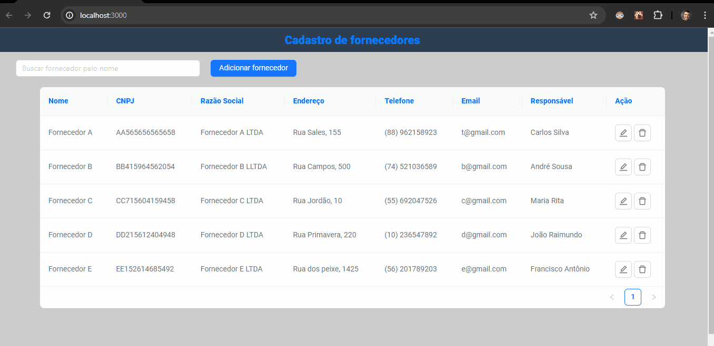

# Supplier Registration
Esta aplicação é um módulo de cadastro de fornecedores para o sistema de gestão de processos de uma organização. Onde é possível cadastrar fornecedor, listar fornecedores cadastrados, editar, visualizar e excluir fornecedores cadastrados. E conta com sua versão mobile, possibilitando a utilização em celulares. 

## Instalação
1. Clone o repositório: git clone https://github.com/tobiasramos/supplier-registration.git
2. Acesse o diretório do projeto: cd supplier-registration
3. Instale as dependências: npm install

## Uso
1. Execute o projeto localmente: npm run dev
3. Abra o navegador e acesse: http://localhost:3000

## Tecnologias utilizadas
- HTML
- CSS
- TYPESCRIPT
- NEXTJS
- ZUSTAND
- ANT DESIGN

## Projeto em execução
{:target="_blank"}